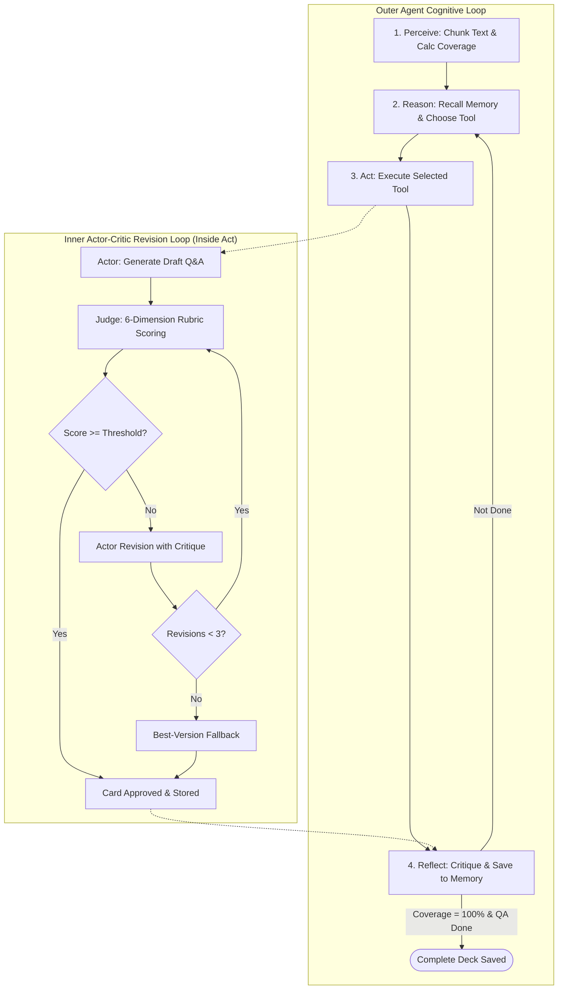
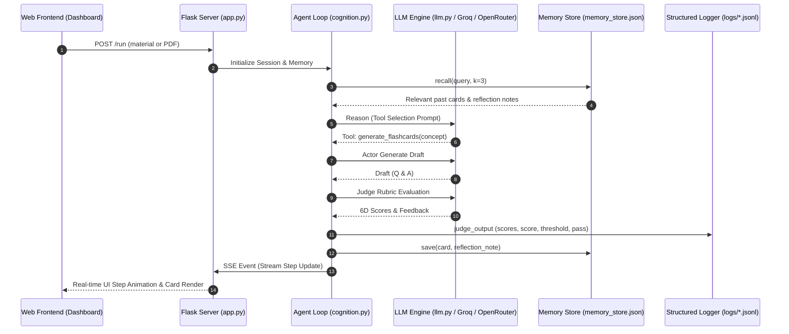

# 📑 Comprehensive Project Report: Autonomous Flashcard Agent

---

## 📌 1. Problem Statement

Creating high-quality study flashcards from dense, technical study materials (textbooks, lecture transcripts, academic papers) is a labor-intensive cognitive task. When students and professionals attempt to automate flashcard creation using naive, single-prompt Large Language Models (LLMs), significant failure modes arise:

1. **Hallucination & Inaccuracy**: LLMs inject external knowledge not present in the grounding source text or fabricate technical definitions.
2. **Compound / Non-Atomic Questions**: Naive prompts generate multi-part questions (e.g., *"Explain DNA, RNA, transcription, and translation"*), which violate flashcard atomicity and make active recall testing ineffective.
3. **Ambiguous Phrasing**: Questions lack context (e.g., *"What is movement?"*), making self-evaluation impossible.
4. **Verbosity & Fluff**: LLMs tend to over-explain simple answers, reducing study efficiency.
5. **No Verification Mechanism**: Single-prompt LLMs lack an adversarial evaluation layer to grade and iteratively fix defects before final presentation.

**Objective**: Build a stateful, autonomous AI agent that accepts raw text or PDF documents and produces atomic, concise, factually accurate flashcards through an iterative **Actor-Critic Self-Correction Loop** backed by **Episodic Memory**, **Multi-Model Fallback**, and **Production Scaffolding** without relying on third-party agent frameworks.

---

## 🎯 2. Use Case

- **Target Users**: Students, educators, researchers, medical/law students, and self-directed learners preparing for high-stakes exams.
- **Input Modalities**: Raw text passages, textbook excerpts, lecture notes, or uploaded **multi-page PDF documents**.
- **Output Artifacts**: A curated, reviewed deck of flashcards with:
  - Concise front question testing **one atomic concept**.
  - Precise back answer grounded 100% in the source.
  - Difficulty classification (`easy`, `medium`, `hard`).
  - Score badge and inspection trace displaying the full iterative revision history and Judge rubric breakdown.
- **Real-Time Visibility**: A live observability dashboard streaming agent thought steps, memory reads, API calls, and retry events in real time.

---

## 🏗️ 3. Workflow Design and Architecture

The architecture is split into two interconnected loops:
1. **The Outer Agent Cognitive Loop (ReAct + Reflexion)**: Directs macro-level execution, chunk progression, concept extraction, and episodic memory persistence.
2. **The Inner Actor-Critic Self-Correction Loop**: Directs micro-level card drafting, 6-dimension rubric evaluation, feedback generation, and revision passes.

```
===================================================================================
                             SYSTEM WORKFLOW PIPELINE
===================================================================================

       ┌─────────────────────────────────────────────────────────────┐
       │                   RAW INPUT (Text or PDF)                   │
       └──────────────────────────────┬──────────────────────────────┘
                                      │
                                      ▼
       ┌─────────────────────────────────────────────────────────────┐
       │                      1. PERCEIVE STEP                       │
       │  • Deterministic chunking into paragraph blocks             │
       │  • Topic identification and word count calculation          │
       └──────────────────────────────┬──────────────────────────────┘
                                      │
                                      ▼
       ┌─────────────────────────────────────────────────────────────┐
       │                   2. REASON STEP (ReAct)                    │
       │  • Recalls relevant memories & reflections from Memory Store│
       │  • Selects next tool via LLM tool-calling schema            │
       └──────────────────────────────┬──────────────────────────────┘
                                      │
                                      ▼
┌─────────────────────────────────────────────────────────────────────────────────┐
│                           3. ACT STEP (Tool Execution)                          │
│                                                                                 │
│   ┌─────────────────────────────────────────────────────────────────────────┐   │
│   │                    INNER ACTOR-CRITIC REVISION LOOP                     │   │
│   │                                                                         │   │
│   │   [ACTOR] Generates initial draft card for target concept               │   │
│   │      │                                                                  │   │
│   │      ▼                                                                  │   │
│   │   [JUDGE] Evaluates on 6D Rubric (Accuracy, Relevance, Clarity, etc)    │   │
│   │      │                                                                  │   │
│   │      ▼                                                                  │   │
│   │   [CHECK] Weighted Score >= 8.5/10 Threshold?                           │   │
│   │      ├── YES ──► Card Approved (PASS)                                   │   │
│   │      └── NO  ──► ACTOR REVISION (Max 3 Revisions) / Fallback to Best    │   │
│   └─────────────────────────────────────────────────────────────────────────┘   │
└─────────────────────────────────────┬───────────────────────────────────────────┘
                                      │
                                      ▼
       ┌─────────────────────────────────────────────────────────────┐
       │                   4. REFLECT STEP (Reflexion)               │
       │  • Generates iteration critique & updates coverage %        │
       │  • Writes approved cards & critique to memory_store.json    │
       └──────────────────────────────┬──────────────────────────────┘
                                      │
                   Loop until 100% covered & QA complete
```

---

## 📐 4. Architecture Diagrams

### A. Nested Dual-Loop Architecture Diagram



### B. Memory and Observability Dataflow



---

## 🤖 5. Agents, Tools, and Integrations

### A. Agent Roles
1. **Orchestrator Agent ([`cognition.py:reason`](file:///d:/Education/Workflow%20project/Flash_card_agent/cognition.py#L101-L218))**: Governs high-level flow, monitors chunk coverage, and selects tool actions.
2. **Actor Generator ([`tools.py:_ACTOR_GENERATE_SYS`](file:///d:/Education/Workflow%20project/Flash_card_agent/tools.py#L88-L107))**: Synthesizes atomic, creative Q&A pairs.
3. **Independent Judge Evaluator ([`tools.py:_JUDGE_SYS`](file:///d:/Education/Workflow%20project/Flash_card_agent/tools.py#L190-L245))**: Evaluates drafts objectively against grounding text across 6 dimensions.
4. **Actor Actuator Revisor ([`tools.py:_REVISE_SYS`](file:///d:/Education/Workflow%20project/Flash_card_agent/tools.py#L65-L85))**: Implements feedback critiques to rewrite defective cards.

### B. Tool Inventory ([`tools.py`](file:///d:/Education/Workflow%20project/Flash_card_agent/tools.py))
- `extract_key_concepts(chunk_text, max_concepts)`: Extracts testable concepts from uncarded text.
- `generate_flashcards(concept, source, n_variants)`: Executes the full Actor-Critic revision loop.
- `score_flashcard(front, back, concept, source)`: Runs standalone rubric evaluation.
- `review_deck(deck)`: Audits the complete deck for duplicates, weak cards, or missing topics.
- `revise_flashcard(card_index, feedback)`: Directly revises a flagged card in the final QA pass.

### C. System Integrations
- **Flask Application Server ([`app.py`](file:///d:/Education/Workflow%20project/Flash_card_agent/app.py))**: REST APIs (`/api/flashcards`, `/api/logs`, `/api/extract-pdf`) and Server-Sent Events (`/stream/<run_id>`).
- **PDF Extraction Engine (`pypdf`)**: Parses multi-page PDF documents with drag-and-drop support.
- **Multi-Provider LLM Fallback Engine ([`llm.py`](file:///d:/Education/Workflow%20project/Flash_card_agent/llm.py))**: Automatic failover across Groq (`llama-3.3-70b-versatile`, `llama-3.1-8b-instant`, `openai/gpt-oss-20b`) and OpenRouter (`gemma-4-31b-it:free`, `nemotron-3-super-120b-a12b:free`, `gpt-oss-20b:free`).
- **Structured Logger ([`logger.py`](file:///d:/Education/Workflow%20project/Flash_card_agent/logger.py))**: Writes JSON Lines (`.jsonl`) logs tracking step timings, token usage, Actor drafts, Judge scores, and thresholds.

---

## 📚 6. Fidelity to Research Papers

| Research Paper | Theoretical Concept | Source Code Mapping | Exact Line Reference |
| :--- | :--- | :--- | :--- |
| **ReAct** *(Yao et al., 2022)* | Synergizing reasoning traces and action execution. | [`cognition.py:reason()`](file:///d:/Education/Workflow%20project/Flash_card_agent/cognition.py#L101-L218) & [`cognition.py:act()`](file:///d:/Education/Workflow%20project/Flash_card_agent/cognition.py#L259-L398) | Lines 101–218, 259–398 |
| **Reflexion** *(Shinn et al., 2023)* | Verbal reinforcement learning through episodic memory critique. | [`cognition.py:reflect()`](file:///d:/Education/Workflow%20project/Flash_card_agent/cognition.py#L404-L478) & [`memory.py:Memory`](file:///d:/Education/Workflow%20project/Flash_card_agent/memory.py#L43-L115) | Lines 404–478 in cognition, Lines 43–115 in memory |
| **Self-Refine** *(Madaan et al., 2023)* | Iterative generation, critique evaluation, and refinement. | [`tools.py:handle_generate_flashcards()`](file:///d:/Education/Workflow%20project/Flash_card_agent/tools.py#L95-L195) | Lines 95–195 |
| **LLM-as-a-Judge** *(Zheng et al., 2023)* | Independent multi-dimension named rubric evaluation with weighted aggregation. | [`tools.py:handle_judge_flashcard()`](file:///d:/Education/Workflow%20project/Flash_card_agent/tools.py#L210-L248) & [`benchmark_judge_reliability.py`](file:///d:/Education/Workflow%20project/Flash_card_agent/benchmark_judge_reliability.py) | Lines 210–248 |
| **Tree of Thoughts** *(Yao et al., 2023)* | Variant generation, state evaluation, and best-path selection. | [`tools.py:handle_generate_flashcards()`](file:///d:/Education/Workflow%20project/Flash_card_agent/tools.py#L140-L175) | Lines 140–175 (Best-version fallback) |

---

## ⚖️ 7. Assumptions, Limitations, and Future Enhancements

### A. Core Assumptions
1. **Text Grounding**: Study material is available as readable text or extractable PDF text.
2. **Deterministic Thresholding**: The quality threshold (default $8.5/10$) is strictly enforced in Python rather than relying on LLM self-reporting.
3. **Structured JSON Output**: Models support JSON response formats.

### B. Known Limitations
1. **Free-Tier Provider Quotas**: Free-tier models have daily token caps ($100\text{k}$ TPD on Groq, $50$ requests/day on OpenRouter). *Mitigated via multi-model fallback in `llm.py`.*
2. **Scanned / Image-Only PDFs**: `pypdf` extracts text layers; non-OCR scanned image PDFs require an external OCR pre-processor.
3. **Lexical vs Dense Semantic Retrieval**: `memory.py` uses BM25/Jaccard term-frequency matching; synonyms with completely disjoint vocabulary require vector embeddings.

### C. Future Enhancements
1. **Dense Vector Database**: Upgrade `memory.py` backend to ChromaDB or FAISS for multi-million token textbook libraries.
2. **Multi-Modal Vision Support**: Use vision models to extract diagrams, formulas, and charts directly from textbook pages into visual flashcards.
3. **Anki / Spaced Repetition Export**: Direct `.apkg` export with SM-2 spaced repetition interval metadata for seamless import into Anki.
